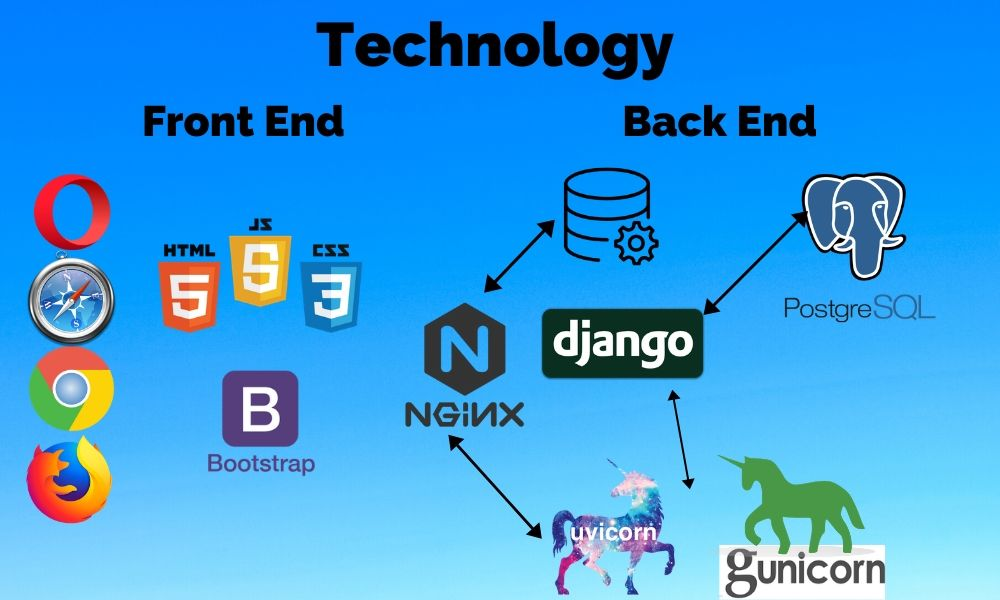
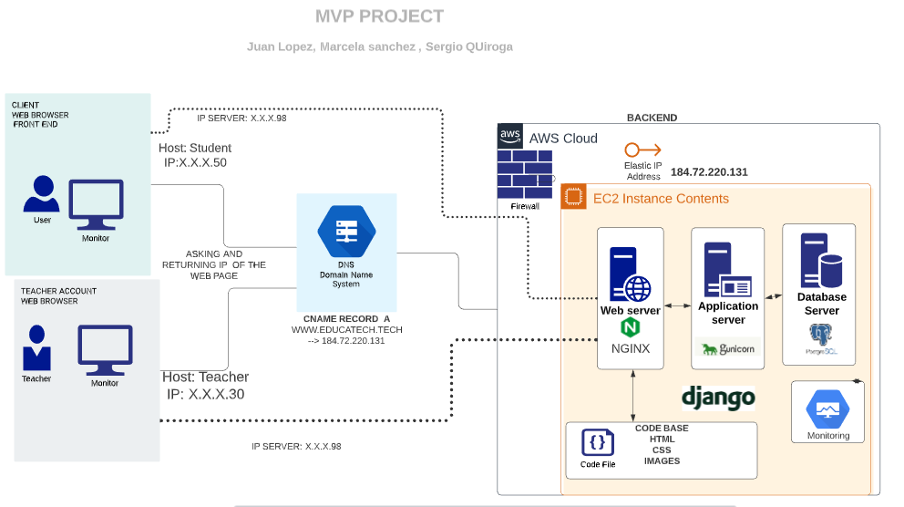
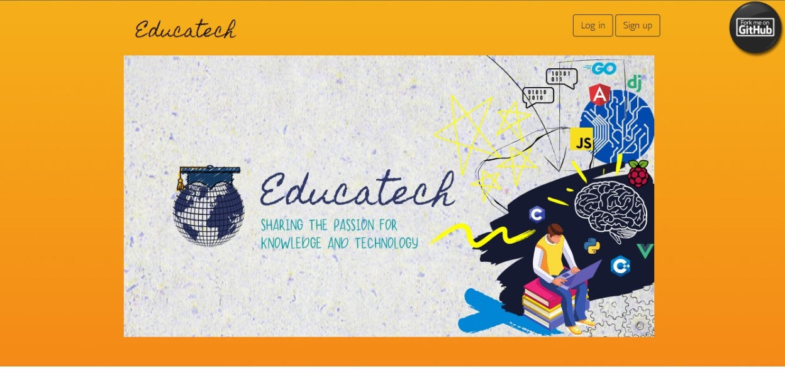
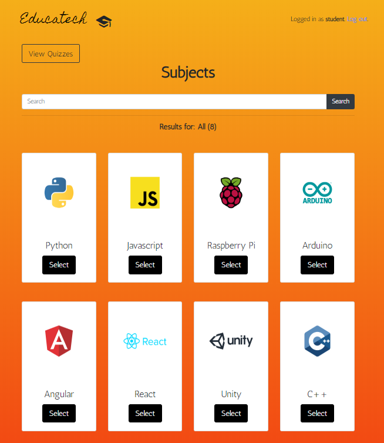
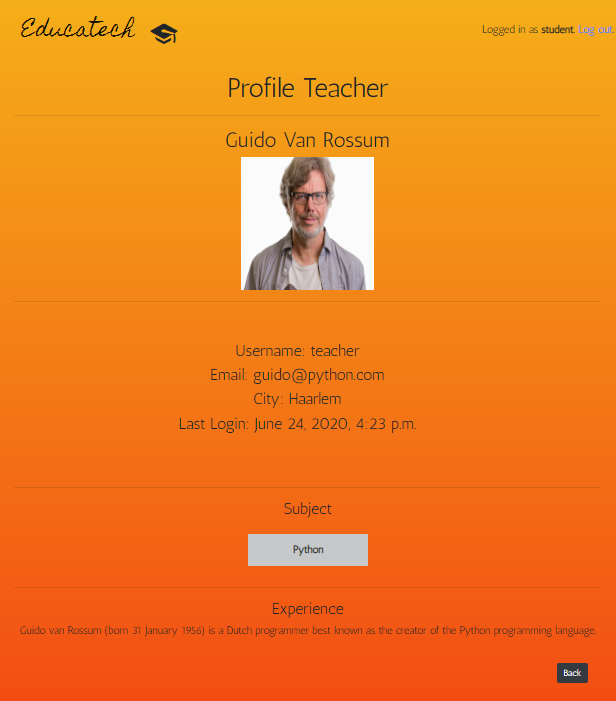
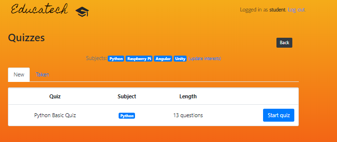
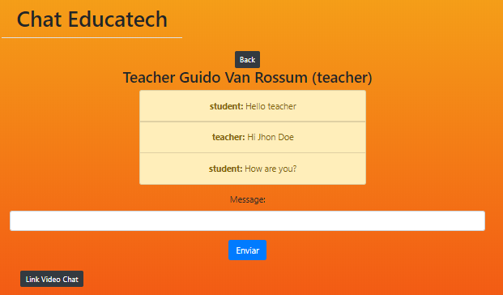

# Educatech
### Sharing the passion for knowledge and technology
[](https://python.org)
[](https://djangoproject.com)

[<p align="center"></p>](http://www.educatech.tech)

In the world of technology we are in constant learning, many of us have dealt with the fact of being stuck with some particular subject and on the Internet we only find extensive texts or a thousand and one video tutorials explaining for hours that subject which is so difficult for us, how many times have we needed someone who in real time explains and guides us in these circumstances, we believe that most of the time we would like to have the possibility of having a personalized advice in this way and that is why we thought of creating Educatech.

Our platform is aimed at technology-related topics and communities, for example, programming basics and fundamentals, software and hardware that allow the user to have a more interactive and personalized advice, communicate with a "teacher" through a chat or video call to facilitate contact, which is a plus in our product.


We connect people through these personalized tutorials and advice, giving them the opportunity to improve and discover their skills in a collaborative community to make their way in the world of technology.

## The context  💡

This project is our final portfolio project, concluding our Foundations year at  **Holberton School**. We were able to choose who we wanted to work with and what we wanted to work on, during about three weeks of development, we were able to create, implement, program our project, this helped us to discover and see in action all the potential of ourselves and our team, we put to the test the knowledge obtained during the first year, our tenacity, discipline, imagination, creativity and what we are capable of as programmers and as people.

We put a little bit of ourselves into this project so that it can help many people, just as Holberton and learning programming helped us.  ♥️

## Blog post :pencil:

Here we tell you a little more about what we experienced in this adventure by creating Educatech.

* Juan Lopez's blog: [Click me](https://medium.com/@jclopez100/education-without-limits-88842dc7b996)
* Marcela Sánchez's blog:
* Sergio Quiroga's blog:

##  Technology :floppy_disk:

<p align="center"></p>

## Architecture :rocket:

<p align="center"></p>

The architecture in our web page is when the user enters our web page, it will validate that the domain is stored in the DNS servers and it will return an IPV4 so that it redirects to the server where our information is stored but the user can only see the Front End (HTML, CSS, JS [jQuery] ) and Bootstrap as css framework.

Our page will take into account 2 types of users students and teachers, to use this service you need a user account. This information goes to our server and is stored in the database (Postgres), we used EC2 Instance contents AWS(Amazon Web Services) is a software platform that allows you to create, test and deploy applications quickly, Nginx as a web server that is when a user makes the request for access to a page, will be used as a web framework Django that allows easy integration with the database and APIs, Firewall that serves as security and restrict access to our server and monitoring for review of information in real-time and gunicorn for Deploy our project is a [Python](https://en.wikipedia.org/wiki/Python_(programming_language))  [Web Server Gateway Interface](https://en.wikipedia.org/wiki/Web_Server_Gateway_Interface) (WSGI) [HTTP server](https://en.wikipedia.org/wiki/Web_server) and the Gunicorn server is broadly compatible with Django Python web framework , simply implemented, light on server resources and fairly fast.

If all goes well, the idea is to link students and teachers, so that they can communicate using our servers and carry out their activities.

## Installation :heavy_check_mark:

First, clone the repository to your local machine:

```bash
git clone https://github.com/Juan-Bogota/Educatech.git
```
#### Create virtual environment:

Review this [link](https://packaging.python.org/guides/installing-using-pip-and-virtual-environments/
) to know how to create a Virtual Environment.

#### Install the requirements:

```bash
pip3 install -r requirements.txt
```
#### Install pgAdmin4 (optional):

```
pip3 install https://ftp.postgresql.org/pub/pgadmin/pgadmin4/v4.17/pip/pgadmin4-4.17-py2.py3-none-any.whl
```
#### Configure and run pgAdmin 4 (optional):
After completing the installation steps, you have to: open the folder of virtual enviroments and create a configuration file to run this software.
Create a new file named ```config_local.py``` in ```lib/python3.6/site-packages/pgadmin4/``` folder using favorite editor.

For example:
```
emacs lib/python3.6/site-packages/pgadmin4/config_local.py
```
Add the following content in **config_local.py**.
```
import os
DATA_DIR = os.path.realpath(os.path.expanduser(u'~/.pgadmin/'))
LOG_FILE = os.path.join(DATA_DIR, 'pgadmin4.log')
SQLITE_PATH = os.path.join(DATA_DIR, 'pgadmin4.db')
SESSION_DB_PATH = os.path.join(DATA_DIR, 'sessions')
STORAGE_DIR = os.path.join(DATA_DIR, 'storage')
SERVER_MODE = False
```

Now, use the following command to run pgAdmin.
```
python3 lib/python3.6/site-packages/pgadmin4/pgAdmin4.py
```
review pgAdmin installation in this [link](https://linuxhint.com/install-pgadmin4-ubuntu/).

#### Create the database:

* open postgres:

```
$ sudo -i -u postgres

postgres$ psql

postgres# CREATE DATABASE dbeducatech;

```

* migrations
```
python3 manage.py makemigrations classroom
python3 manage.py makemigrations chat
```
```bash
python3 manage.py migrate
```
Finally, run the development server:

```bash
python3 manage.py runserver
```

The project will be available at **127.0.0.1:8000**.


#### Open & Test Redis:
- Open other Terminal
- Run redis-server

```
        $ redis-server
        86750:C 08 Nov 08:17:21.431 # Warning: no config file specified, using the default config. In order to specify a config file use redis-server /path/to/redis.conf
        86750:M 08 Nov 08:17:21.433 * Increased maximum number of open files to 10032 (it was originally set to 256).
                        _._                                                  
                   _.-``__ ''-._                                             
              _.-``    `.  `_.  ''-._           Redis 3.2.5 (00000000/0) 64 bit
          .-`` .-```.  ```\/    _.,_ ''-._                                   
         (    '      ,       .-`  | `,    )     Running in standalone mode
         |`-._`-...-` __...-.``-._|'` _.-'|     Port: 6379
         |    `-._   `._    /     _.-'    |     PID: 86750
          `-._    `-._  `-./  _.-'    _.-'                                   
         |`-._`-._    `-.__.-'    _.-'_.-'|                                  
         |    `-._`-._        _.-'_.-'    |           http://redis.io        
          `-._    `-._`-.__.-'_.-'    _.-'                                   
         |`-._`-._    `-.__.-'    _.-'_.-'|                                  
         |    `-._`-._        _.-'_.-'    |                                  
          `-._    `-._`-.__.-'_.-'    _.-'                                   
              `-._    `-.__.-'    _.-'                                       
                  `-._        _.-'                                           
                      `-.__.-'                                               

        86750:M 08 Nov 08:17:21.434 # Server started, Redis version 3.2.5
        86750:M 08 Nov 08:17:21.434 * The server is now ready to accept connections on port 6379
```
     
- redis-cli ping
```
$ redis-cli ping
PONG
```
- Close Redis with `control` + `c` to quit.

## Features :dart:

Here you can find the link of the [landing page](https://educatech-landpage.bss.design/) and the [Educatech](http://www.educatech.tech) domain, in both we show all features created.

* Home page

<p align="center"></p> 

* Log in / Sign up

<p align="center">

</p>

* Search Subjects

<p align="center"></p>

* Teacher's profile

<p align="center"></p>

* Quizzes

<p align="center"></p>

* Chat Teacher - Student

<p align="center"></p>

## Contributing :raised_hands:

We believe in the power of learning and sharing it, if you want to contribute to this project, feel free to make a pull-request to help us improve or implement any feature.

## Authors :smiley::computer:
* Juan Carlos López

[Github](https://github.com/Juan-Bogota) - [Twitter](https://twitter.com/jclopez100) - [Linkedin](https://www.linkedin.com/in/juan-carlos-lopez-50698369/) 

1213@holbertonschool.com

* Marcela Sánchez

[Github](https://github.com/marcewp15) - [Twitter](https://twitter.com/MarceWp15) - [Linkedin](https://www.linkedin.com/in/lady-marcela-s%C3%A1nchez-moreno-277922184/) 

970@holbertonschool.com

* Sergio Quiroga 

[Github](https://github.com/Sergioq7777) - [Twitter](https://twitter.com/sergioq7777) - [Linkedin](https://www.linkedin.com/in/sergio-andr%C3%A9s-quiroga-monroy-49255317b/) 

1230@holbertonschool.com


## License :pushpin:
[MIT License](https://github.com/Juan-Bogota/Educatech/blob/master/LICENSE)
